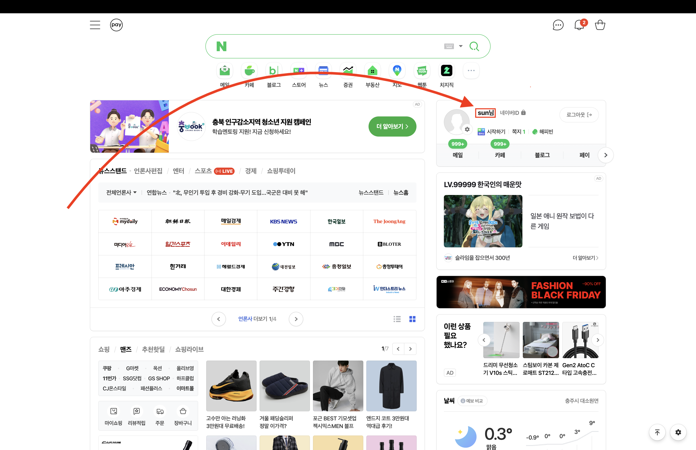
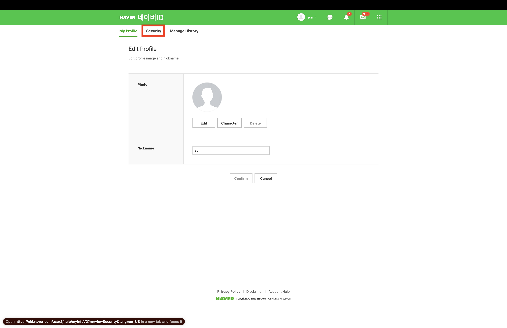
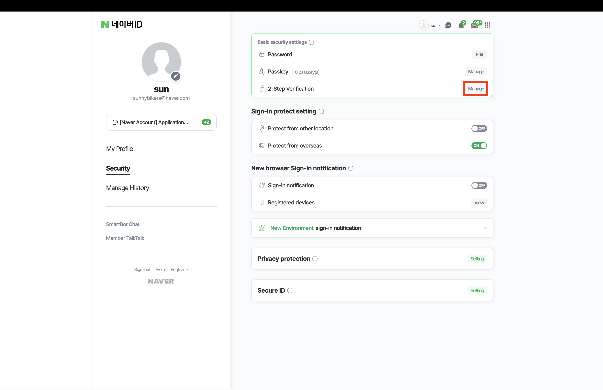
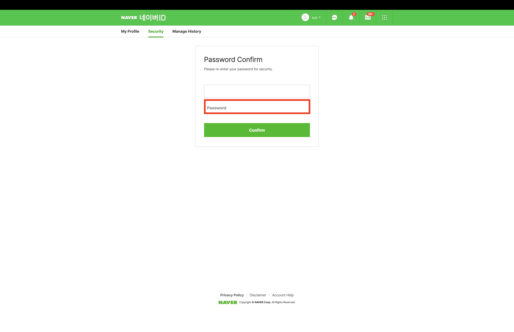
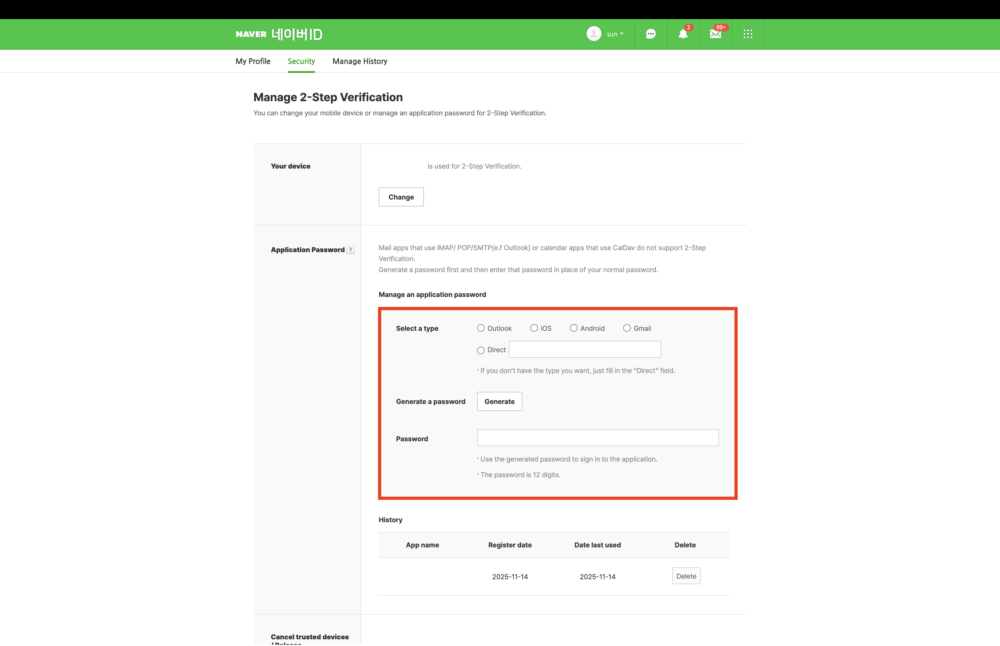
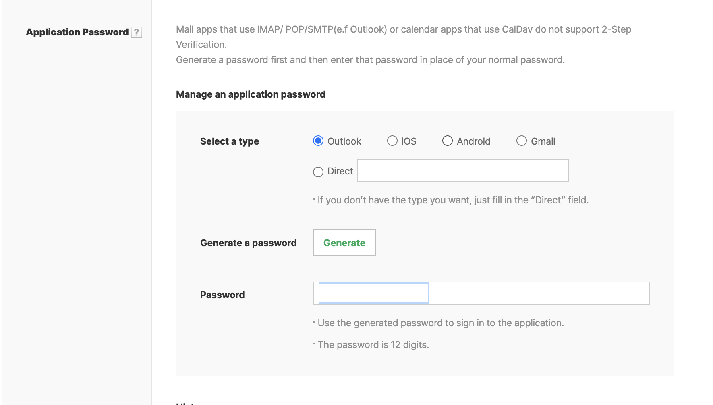
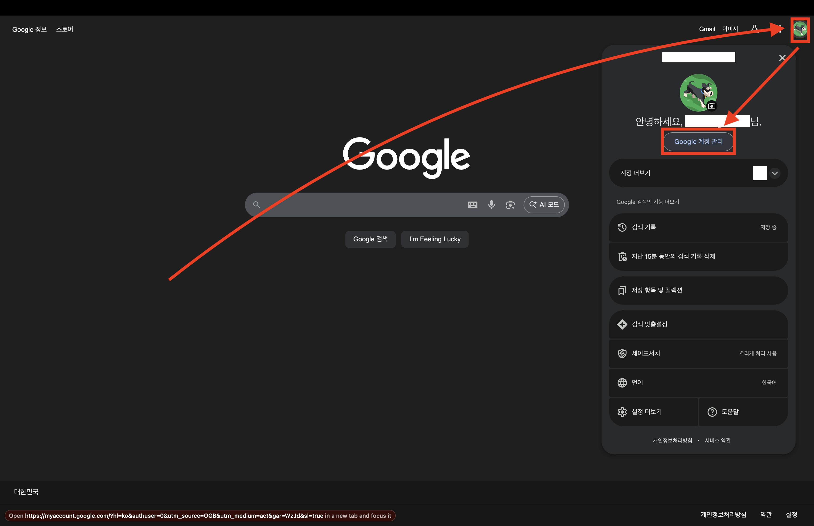
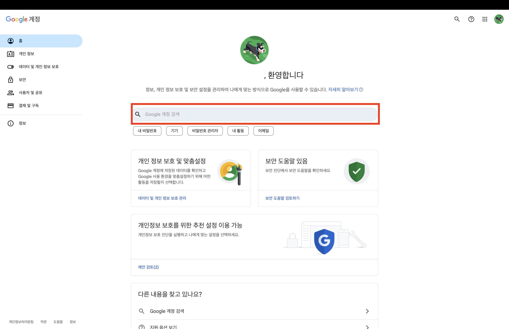
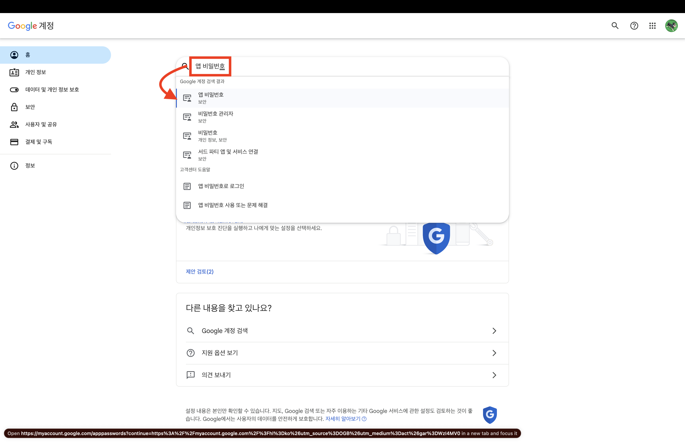
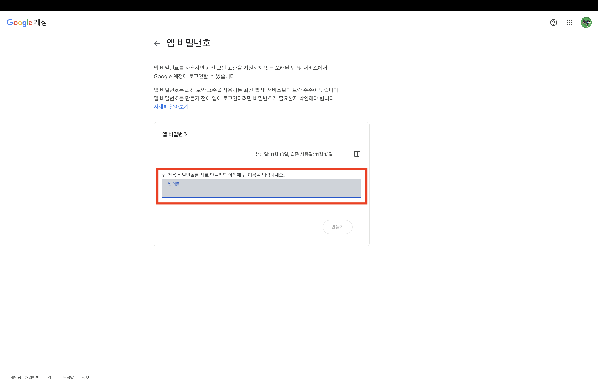

# open-mission

## 메일 전송 프로그램

### Table
0. [사용법](#0-사용법)
1. [기능 요구 사항](#1-기능-요구-사항)
    - [메일 전송 프로그램](#1-메일-전송-프로그램)
    - [입력](#2-입력)
    - [출력](#3-출력)
    - [과정](#4-과정)
2. [프로그램 로직](#2-프로그램-로직)
3. [긴급 요구사항 변경 사항](#3-긴급-요구사항-변경-사항)

---
## 0. 사용법

- Naver와 Google 계정 중 하나를 선택하여 메일을 전송할 수 있습니다.
    - 각 이메일을 사용하기 위해서 앱 비밀번호를 설정한 후 `.env` 파일에 추가해야 합니다.

- Naver
    - 
    - 
    - 
    - 
    - 
    - 
- Google
    - 
    - 
    - 
    - 

---

## 1. 기능 요구 사항
### 1. 메일 전송 프로그램
- 사용자는 상대방에게 메일을 전송할 수 있다.
    - 상대방(컴마 구분자로 복수 지정 가능), 제목, 내용을 입력하여 전송한다.
    - 전송 후 전송 성공-실패 여부를 확인할 수 있다.
- 전송하지 않고, 도중에 저장이 가능하다.
    - 저장된 초안을 꺼내어 작성 후 전송할 수 있다.
- 사용자는 자신이 보낸 메일들을 확인할 수 있다.

### 2. 입력
> - 내 메일 주소
> - 상대방 메일 주소
> - 메일 제목
> - 메일 내용

### 3. 출력
> - 전송 성공-실패 여부 출력

### 4. 과정

[//]: # (0. [임시 저장] 임시 저장 메일 사용하기)
[//]: # (   1. [출력] 임시 저장 메일 리스트 보여주기)
[//]: # (   2. [과정] 선택 시 해당 메일 이어서 작성하기)
1. [입력] 발신자 메일 주소 지정하기
2. [입력] 수신자 메일 주소 지정하기
3. [입력] 메일 제목 입력하기
4. [입력] 메일 내용 입력하기
5. [전송] 메일 전송하기
6. [출력] 전송 성공-실패 여부 출력하기

[//]: # (5. [임시 저장] 1~4 단계에서 임시 저장 가능)

> #### 입력값에 대한 예외 처리
>
> - 메일 주소 : '^[a-zA-Z0-9+-\_.]+@[a-zA-Z0-9-]+\.[a-zA-Z0-9-.]+$' 형식
> - 메일 제목 : 공백 X
> - 메일 내용 : 공백 X

---
## 2. 프로그램 로직

1. 메일 작성 - (새로운 메일 작성 or 임시 저장 메일 작성)
    1. 발신자 메일 주소
    2. 수신자 메일 주소 (복수개)
    3. 메일 제목
    4. 메일 내용
2. 전송

[//]: # (1-3 단계 계속 반복)

---
## 3. 긴급 요구사항 변경 사항

- Phase 1: 메일 우선순위 시스템 도입 
- Phase 2: 참조(CC) 수신자 기능 추가 
- Phase 3: Outlook(Live) 계정 지원 
- Phase 4: 메일 전송 로그 저장 
- Phase 5: 전송 실패 재시도 로직
